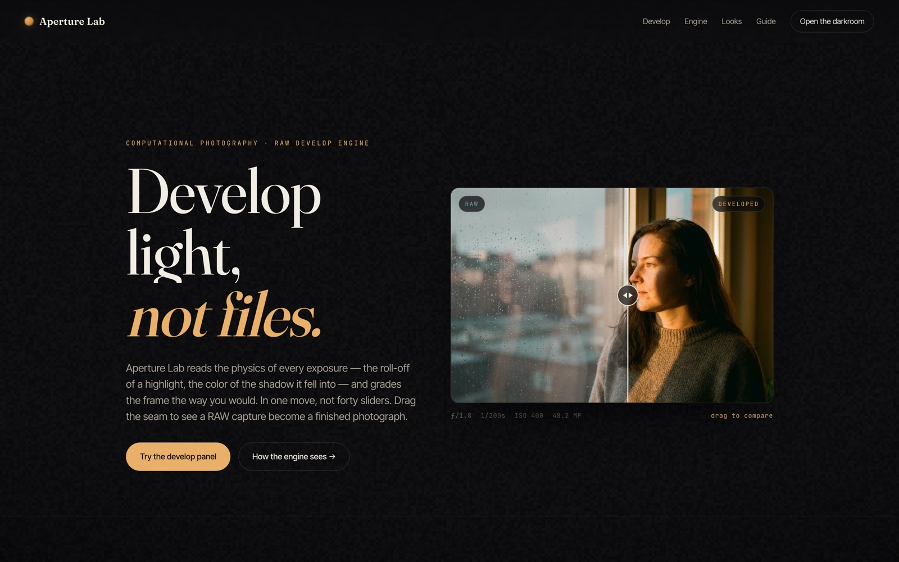

<!-- parable:beautified -->
<div align="center">

<h1>Aperture Lab</h1>

<p><strong>Computational-photography RAW editor — cinematic darkroom, WebGL film grain.</strong></p>

<p>
  <a href="https://bswxyz.github.io/aperture-lab/"></a>
  
  
  <a href="LICENSE"></a>
</p>

<p>
  <a href="https://bswxyz.github.io/aperture-lab/"><b>Live demo</b></a>
  &nbsp;·&nbsp;
  <a href="https://bswxyz.github.io/aperture-lab/guide/">Build notes</a>
  &nbsp;·&nbsp;
  <a href="https://parable-three.vercel.app/templates">More templates</a>
</p>

<a href="https://bswxyz.github.io/aperture-lab/">
  
</a>

</div>

**Use this template** — copy the source into a new project:

```bash
npx degit bswxyz/aperture-lab my-app
```


A computational-photography / AI-RAW-editor landing site with a working, browser-side develop
experience — part of the [Parable 25 design showcase](https://parable-three.vercel.app).

---

## The concept

Aperture Lab is a RAW photo editor whose pitch is that a flat capture *already contains* a finished
photograph — the software just develops it. It's aimed at photographers who shoot RAW and are tired
of dragging forty sliders per frame. The site sells that feeling in the first five seconds: drag a
seam across one image and watch a RAW negative become a graded photograph, then grade it yourself in
a live develop rack. Positioned as premium/pro, not a consumer filter app.

## Design system

- **Palette (darkroom):**
  `--stage:#0a0a0b` near-black stage · `--stage-2:#111012` raised surface · `--ink:#f2ede4` warm ivory ·
  `--dim:#a8a196` · `--faint:#6e685e` · `--amber:#e8b06a` safelight accent · `--amber-deep:#c8863f` ·
  `--teal:#6fa0a8` (the cool cast of an un-graded RAW) · `--line:rgba(242,237,228,.12)`.
  Amber is the single hero accent; teal exists only to make "RAW" read as cold against the warm develop.
- **Type:** `Fraunces` (optical serif, display + numerals — the darkroom voice) · `Inter Tight`
  (UI/body) · `JetBrains Mono` (EXIF-style technical labels, kickers, values). One serif for feeling,
  one grotesque for control, one mono for instrumentation.
- **Signature motion:** an expo-out `cubic-bezier(.16,1,.3,1)` used everywhere for a slow, cinematic
  settle; a clipped-line hero intro; a sine-drift auto-demo on the compare seam; GSAP-tweened
  slider values on Auto-develop.
- **Why these fit:** a RAW editor is about tone and restraint, so the identity is near-monochrome with
  a single warm light source — the amber "safelight" — and the photograph is the brightest thing on
  the page. Nothing competes with the image.

## Stack

- **Plain HTML / CSS / vanilla JS.** No framework, no build step, no bundler.
- **[GSAP 3.12](https://gsap.com/)** (CDN) — used narrowly to tween the develop-slider state on
  Auto-develop and Look changes. Everything else is native `requestAnimationFrame` + CSS transitions.
- **Canvas 2D** for the film-grain overlay and the illustrative histogram.
- Chosen because the two signature effects (a clip-path reveal and a CSS-filter grade) are essentially
  free in the browser; a framework would add weight to a page that is one image and six sliders.

## Running it locally

No install. Any static server works because all paths are relative:

```bash
git clone https://github.com/bswxyz/aperture-lab
cd aperture-lab
python3 -m http.server 8000      # or: npx serve .
# open http://localhost:8000
```

There is nothing to build. Edit `index.html` / `styles.css` / `main.js` and refresh.

## Structure

```
index.html          the page (semantic sections; .js gate for progressive enhancement)
styles.css          all styling — design tokens live in :root at the very top
main.js             compare-reveal, develop rack, looks, grain, histogram, counters, reveals
assets/frame.jpg    the single generated frame the whole site develops (3:2, compressed)
guide/index.html    the "how it was built" write-up (self-contained, styled to match)
.nojekyll           tells GitHub Pages to serve files as-is
```

Design tokens: `styles.css` `:root`. The develop math (filter composition, look recipes) lives in
`main.js` under the `computeFilter` and `LOOKS` definitions.

## Demo vs. real — what a production version would need

This is an intentionally-scoped demo. What's **mocked/static** today:

- **The "develop engine" is a CSS-filter approximation.** Real RAW develop needs a scene-referred,
  per-pixel pipeline (demosaic, tone mapping, local/luminance-masked adjustments) — a CSS `filter`
  cannot mask by luminance or region. Highlights/Shadows here are global approximations.
- **One image, no RAW decode.** A production app would decode actual RAW files (libraw/rawpy or a WASM
  decoder), not grade a pre-baked JPEG.
- **The histogram is illustrative** — derived from slider state, not sampled from pixels.
- **"AI Auto-develop" is a fixed target**, not a learned model. Real auto-grade = an on-device or server
  inference pass (segmentation + tone prediction).
- **No accounts, catalog, storage, export, or payments.** A real product needs a photo library, non-
  destructive edit history, export/render, and sync.

What's **real** and reusable as-is: the compare-reveal interaction, the live develop-rack UI and state
model, the looks system, the grain renderer, the full responsive/reduced-motion/keyboard layer, and the
whole visual system.

## License

[MIT](LICENSE). Design & build by **Parable**. The hero image is AI-generated.
